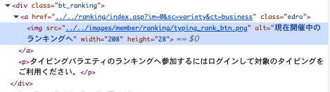
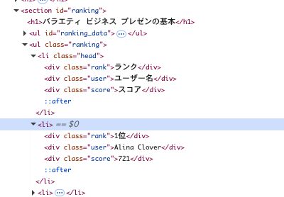
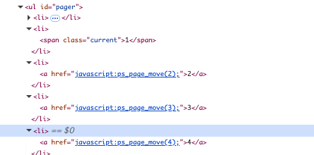

# e-typingのランキングからデータを取得する

e-typingのランキングからデータを取得していきます。

ランキングを取得する処理は、Cloudflare WorkersのCron Triggersで定期実行したいので、Cloudflare Workersで動作するライブラリを使いたいです。

最初はデバッグのためnode.jsで動かします。

## タスク一覧

- [x] e-typingのランキングデータを取得する処理を実装して、nodeで実行する。
  - 最初はページ数の少ないスタディのランキングを取得する。取得したデータばJSONに書き出す。
- [x] スタディ以外の12種目のデータも取得できるようにする
- [x] 簡易的なスクレイピングAPIを作成し、Cloudflare Workersにデプロイする。動作確認のため1ページのみ取得すればよい。
- [ ] 上記のAPIを、Cron Triggersで定期実行してみる。

## 完了条件

- [x] nodeでe-typingの13種目のランキングを取得し、JSONで保存していること
- [x] Cloudflare Workersでスクレイピングの簡易APIが動作していること
- [ ] 上記のAPIがCron Triggersで動作すること

## 参考情報

### ランキングページへのアクセス方法

e-typingのバラエティのランキングのページは、各種目のページ下部からアクセスできます。ランキングのリンクのHTMLの構造は次のとおりです。

ランキングのURLは13種目で共通で、https://www.e-typing.ne.jp/ranking/category.asp です。

バラエティの各種目のページのURLは、以下のとおりです。

- ビジネス: https://www.e-typing.ne.jp/roma/variety/business.asp
- スタディ: https://www.e-typing.ne.jp/roma/variety/study.asp
- ライフ: https://www.e-typing.ne.jp/roma/variety/life.asp
- トラベル: https://www.e-typing.ne.jp/roma/variety/travel.asp
- スポーツ: https://www.e-typing.ne.jp/roma/variety/sports.asp
- なんだろな？: https://www.e-typing.ne.jp/roma/variety/what.asp
- 脳トレ: https://www.e-typing.ne.jp/roma/variety/brain.asp
- 方言: https://www.e-typing.ne.jp/roma/variety/dialect.asp
- 長文: https://www.e-typing.ne.jp/roma/variety/long.asp
- テンキー: https://www.e-typing.ne.jp/roma/variety/tenkey.asp
- 百人一首: https://www.e-typing.ne.jp/roma/variety/hyakunin.asp
- しりとり: https://www.e-typing.ne.jp/roma/variety/siritori.asp
- 医療介護: https://www.e-typing.ne.jp/roma/variety/medical.asp

### ランキングの構造

以下のように、idがrankingの要素に、li要素でランキングのデータが表示されています。ランキングページは動的ページなので、JavaScriptを実行する必要があります。

### ページャーの構造

