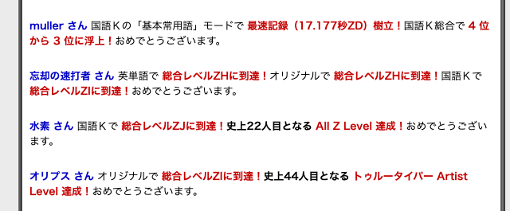

# スコアの更新をトップページに表示する

GANGAS（タイプウェルのランキングサイト）のように、記録が更新されたときにその情報をトップページに表示するようにしたいです。



イメージは以下のような感じです。

```txt
xさん ビジネスで スコアを200→230に更新しました！
yさん 百人一首で スコア250を記録しました！

...
```

## タスク一覧

- [ ] スコアの更新履歴を登録するテーブルを作成する
- [ ] スコア登録APIで、スコア更新履歴テーブルに登録する
- [ ] 更新履歴を取得するAPIを作成する
- [ ] 更新履歴をトップページに表示する

## 完了条件

- [ ] スコアを登録した時に、スコア更新履歴も一緒に登録されること
- [ ] スコアの更新履歴がトップページに表示されること
